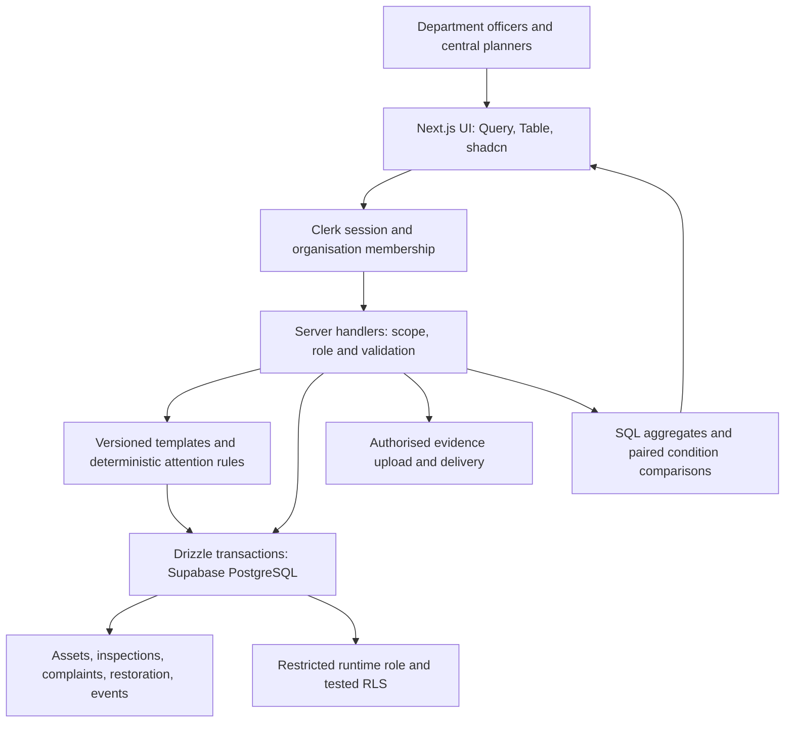

# Government fixed-asset manager: seven-hour implementation plan

Prepared 28 September 2026. Planning document; product capabilities below are proposed, not implemented or certified.

## 1. Product decision

Build a department-scoped system of record for fixed public infrastructure, connected to verified condition assessments, complaints, restoration actions, and regional planning evidence.

The three questions the product must answer are:

1. Which assets require attention, why, and what should happen next?
2. What do we know about a particular asset when a complaint arrives, and how current is that evidence?
3. Which regions have a greater observed restoration backlog, what evidence supports that comparison, and what costs have actually been estimated?

An age-based score cannot establish structural condition. The application supports authorised officers and engineers; it does not diagnose safety or certify structures.

### Confirmed user requirements

- Fixed physical government assets, including roads, bridges, and buildings.
- Each government department is a tenant.
- Central administration proposes department creation for independent governance approval and manages deactivation; special access can inspect multiple departments.
- Asset-specific records and lifecycle history.
- Restoration attention, complaint lookup, regional condition trends, and planning support.
- Multilingual interface for a bounded set of commonly used Indian languages.
- Seven hours available for implementation and submission preparation.
- Working boilerplate and service APIs, as confirmed by the user; avoid repeating setup work.

### Explicit implementation assumptions

- One governing authority in the demonstration, with two departments and three shared regions. Central access is scoped to that authority, not automatically every government organisation nationwide.
- Officers log complaints internally. Public grievance submission and integrations are later work.
- Roads, bridges and buildings are global starters. Departments define their own versioned asset types, fields, checklists and lifecycle transitions through a bounded configuration editor; an independent senior approver publishes them. Published versions are immutable and existing assets stay pinned.
- Prototype condition labels and inspection policies require departmental/engineering confirmation. No national engineering thresholds are invented.
- Department deletion means deactivation when records exist. Permanent deletion is allowed only for empty accidental departments.
- Existing assets may enter the register with incomplete historic records. Missing dates, values, and inspections remain unknown.

## 2. Government research translated into design

These are design references with specific scopes, not a declaration of national compliance.

| Primary reference | Finding used | Design consequence |
| --- | --- | --- |
| [MoRTH/PIB, IBMS launch, 2016](https://www.pib.gov.in/newsite/PrintRelease.aspx?lang=2&reg=48&relid=151406) | Bridge identity, location, engineering attributes, component condition, and public importance inform prioritisation. | Stable identity, category-specific observations, location, and attributable service-criticality information. Historical reference; do not claim integration with IBMS. |
| [MoRTH/PIB, bridge maintenance, 2022](https://www.pib.gov.in/PressReleasePage.aspx?PRID=1885355&lang=2&reg=48) | Treatment depends on distress, function, and loading; condition assessment uses inspections. | Age is context and may prompt review, not a condition diagnosis. Historical explanation, not a replacement for current departmental manuals. |
| [NRRDA, rural-road maintenance guide, 2014](https://pmgsy.nic.in/sites/default/files/pdf/GMMR_2014.pdf) | Overall condition supports programming; detailed surveys support individual works. | Regional summaries guide assessment and planning; they cannot independently specify an engineering intervention. |
| [NRIDA/PMGSY, road maintenance system](https://pmgsy.nic.in/sites/default/files/mapr.pdf) | Condition inventory includes road sections, intervention history, survey/check attribution, and proposed work quantities. | Capture section identity, historic work, assessor/reviewer, and sourced estimates. Rural-road reference, not a universal asset schema. |
| [GIGW 3.0 focus areas](https://guidelines.india.gov.in/focus-areas/) | Government web guidance covers quality, accessibility, cybersecurity, and lifecycle management, and aligns accessibility with WCAG 2.1 AA. | Keyboard access, labelled forms, visible focus, readable contrast, useful errors, and accessible alternatives to visual summaries. Certification requires a separate assessment. |
| [CAG audit regulations](https://cag.gov.in/en/page-audit-regulations) | Audits can use electronic and documentary evidence and physical verification. | Retain evidence provenance, dated observations, reviewers, and correction history. No claim of CAG certification. |

The [Department of Expenditure lists a January 2026 GFR compilation](https://doe.gov.in/bi-annual-compilationupdation-general-financial-rules-2017-upto-31012026general-financial-rules). Central financial rules, state rules, and infrastructure engineering manuals have different applicability. Do not impose a financial inventory-verification interval as every asset's structural inspection interval. A current clause-by-clause compliance review is outside this sprint.

## 3. Tenancy, authority, and record retention

Clerk supplies identity and credentials; application department memberships are authoritative for domain access. A Clerk Organisation per department may be added as an integration mapping, not an implicit permission grant. First check whether Organisations are enabled; enabling them changes sign-in behaviour and is a configuration decision, not an automatic step. Application permissions establish officer actions and central oversight regardless of whether Clerk Organisations are enabled.

| Role | Authority |
| --- | --- |
| Authority administration capabilities | Propose department creation and governed role/authority-access changes; ordinary permitted administration. Changes needing governance require a different authority governance approver. |
| Authority governance approval capability | Independently approve department/role/authority-membership proposals with version and final-effective-holder protections. |
| Central planner / special viewer | Read records and aggregates for granted departments under the authority; no automatic engineering approval rights. |
| Department management / designated-expert capabilities | Draft department-specific configurations; manage records; independently verify registrations/inspections where granted. Cannot publish their own template or self-promote. |
| Department senior approval capabilities | Independently publish configurations; approve sensitive lifecycle/availability/archival actions and restoration; independently accept completed work. Approval is a department-scoped capability carried by an authority-governed role definition; its display title is editable. |
| Department officer | Register drafts, log complaints, submit inspections and work completion; no approval of their own submissions. |

Use authority-scoped editable role definitions (`role_definitions`) with fixed authority or department scope and permission assignments (`role_permissions`) from a bounded catalog of known operations. Bootstrap role names are editable starter examples, not hard-coded RBAC identifiers. Role creation/edit/retirement and authority membership changes require independent authority governance approval.

Every read and write resolves scope on the server from a verified Clerk session and authorised membership/grant. A requested department ID is a filter, not proof of access. Unassigned users receive no departmental data. Central access is an explicit grant, not a client-side flag or an email string in browser code.

All child records inherit and validate the asset's department. Composite tenant-and-ID foreign keys prevent a complaint, inspection, or evidence link pointing to another tenant's asset. A department-scoped asset code is unique; suspected duplicates across departments are flagged for review, not automatically merged.

Use a restricted database runtime role and tested RLS in addition to resource-level checks. [PostgreSQL documents that owners and BYPASSRLS roles can bypass policies](https://www.postgresql.org/docs/current/ddl-rowsecurity.html). Clerk sessions do not automatically supply tenant context to Drizzle's direct database connection. Transaction-local server-verified context must be set and tested; pooled connections must not retain tenant context. Central policy permits authorised reads separately from writes.

If database enforcement cannot be established during the sprint, keep all access server-side, disable anonymous table access, verify application isolation, and document the missing database guarantee. Do not claim full database isolation.

Deactivation blocks new work and normal departmental access, preserves assets and history for authorised oversight, and does not retire physical assets. Do not cascade-delete infrastructure records. Reassignment/transfer requires an explicit later workflow. Protect the last effective authority administrator and governance approver, including concurrent role/membership edits.

## 4. Asset-specific depth

Maintain five independent dimensions:

1. Registration quality: draft, submitted, verified, correction required.
2. Lifecycle stage: the asset’s pinned published department-template state; starter state names are examples, not universal fixed stages.
3. Service availability: in service, restricted, closed, unknown.
4. Condition: latest approved assessor-entered condition, observation date, evidence and freshness.
5. Work state: proposed, approved, in progress, completion submitted, accepted, cancelled.

Restoration is a dated intervention; it is not automatically the asset's lifecycle stage or proof that condition improved.

| Template | Asset identity and attributes | Inspection observations | Historical milestones |
| --- | --- | --- | --- |
| Road segment | Road/section identifier, start/end chainage or endpoints, length and units, surface and class | Surface defects, drainage, shoulders, affected section and extent | Construction, opening, resurfacing, widening, closures, retirement |
| Bridge | Location, bridge type, span information, dimensions/material when documented | Deck, joints/bearings, superstructure, substructure, waterway observations | Construction, commissioning, rehabilitation, restrictions, replacement |
| Public building | Use, address/region, storeys, floor area and units, commissioning date when known | Roof/water ingress, visible structural distress, services, accessibility observations | Construction, occupancy, renovation, change of use, decommissioning |

These are starter screening templates pending specialist review, not reproduction of an IRC/CPWD certification checklist. The category set also allows department-defined culverts, drains, water tanks, pipelines, public parks, government land and utility structures; it is not restricted to three categories.

Department managers/designated experts draft department-scoped definitions specifying required fields by stage, data types, units, ranges, select options, component checklist, evidence requirements, initial lifecycle state, allowed transitions and requesting roles. Independent senior approvers publish them. Configuration cannot weaken database/server minimum approval or independence controls. Validate on the server and client. Store the template version with assets and inspections; later template changes must not reinterpret old inspections silently.

Location supports a point, line, or polygon concept. For the sprint, record validated coordinates plus road chainage/endpoints and canonical administrative region IDs. A map is optional. A road's full condition cannot be represented by one photograph or one point. Mixed-condition roads should be recorded as identifiable sections; an asset crossing regions needs explicit section attribution instead of assigning its whole length to every region.

Commissioning date precision can be exact, year-only, approximate, or unknown. Never replace unknown age with zero. Store owner and maintenance custodian separately when different. Record source references for important dates, costs, ownership, and location.

### Lifecycle coverage in seven hours

Provide a real bounded department-configuration editor, independent senior publication, versioned asset-specific transitions and attributable evidence-linked history. Lifecycle, service closure/reopening and archival use approval requests: submission leaves the asset unchanged; independent senior approval rechecks the expected asset version and commits decision, asset mutation and history together. Reject stale requests/self-review. Do not implement a drag-and-drop universal designer. Implement operational registration, inspection, complaint, and restoration flows deeply. Historical planning, construction, and commissioning milestones can be entered with their actual event date and documentary reference; audit insertion time remains the current server time. Full procurement, construction management, legal disposal, and payment systems are outside the MVP.

## 5. Minimal relational model

Keep the existing shallow layout and Drizzle schema location. Avoid separate road/building/bridge tables.

| Record | Main purpose |
| --- | --- |
| authorities | Governing scope; one seeded authority initially. |
| departments | Tenant, authority, Clerk organisation mapping, active/deactivated state. |
| role_definitions / role_permissions | Authority-scoped role code/name/version, immutable authority/department scope, and bounded known permission-catalog operations; display names are editable. |
| authority_memberships / department_memberships / central_read_grants | Scoped role memberships and independently approved central read capabilities; no self-service privilege elevation. |
| governance_requests / central_read_requests | Department/region creation, role changes, authority-membership changes and central read scopes pending independent governance approval. |
| regions | Shared canonical hierarchy with validated parent levels and optional externally verified LGD codes, separate from departments. |
| department_templates | Department/code/version, editable draft specification and immutable independently published attributes, checklists, lifecycle states/transitions/permissions. |
| approval_requests | Asset-scoped lifecycle, availability and archive request, expected asset version, evidence/reason, independent senior decision. |
| assets | Department, stable code, pinned template, region, location, lifecycle, provenance, typed attributes, named measure/unit, responsible officer, same-department parent and version. |
| inspections | Asset/department, observed date, submitted/approved dates, assessor/reviewer, component observations, overall assessment, next-review date, template version. |
| complaints | Asset/department or unresolved asset match, reported issue/severity, triage, owner, investigation/resolution state. |
| work_orders / work_estimates | Asset/department, source inspection/complaint, scope, assignee, dates, reviewed sourced estimates, completion/acceptance and post-work verification link. |
| evidence | Parent reference, tenant, file/storage identity, MIME/size, uploader/time, caption and document reference. |
| audit_events / asset_milestones | Redacted append-only runtime history and dated source-backed historical milestones. |
| inspection_components / duplicate_candidates / approval_evidence | Queryable inspection component projection, independently reviewed duplicate flags and retained same-asset decision evidence. |

Global starter definitions may originate in code, but operative department configurations live as versioned `department_templates`. Implement validated structured editing/submission/publication; defer the elaborate drag-and-drop designer. Add `approval_requests` for sensitive actions rather than direct lifecycle/availability/archive updates. Monetary values use exact numeric or integer paise, never floating-point calculations. Unknown estimates stay null.

Use database transactions for a business change and its event. Use optimistic row versions to reject concurrent overwrites and idempotency protection on retryable creation/submission. Approved observations are preserved; corrections create a superseding record with reason and reference. Append-only application history is not tamper-proof against database administrators.

Role creation/edit/retirement and authority membership operations are proposals first, with no effective mutation until independent `governance_approve`. Department creation follows the same request/approval procedure. Role scope is immutable. Retirement is blocked by any active or inactive membership or pending invitation; expose counts and require explicit reassignment (including all 10 people when a role has 10 members) before retirement. Recheck record versions and final effective administrator/approver capabilities under locks.

For scale, use B-tree indexes on department plus code, region/category, date and state; asset/date inspection lookups; unresolved complaints; and outstanding restoration actions, with partial indexes matching open-queue predicates and tenant-qualified foreign-key indexes. Use GIN on a language-agnostic `simple`-configuration tsvector for source-text token search; preserve original Unicode and disclose that this is not seven-language morphological stemming. Add JSONB GIN only for demonstrated query needs. PostgreSQL does not provide an ordinary built-in LSM replacement; do not add a competing engine. Claim no speed improvements without representative query-plan/benchmark evidence. Paginate/filter on the server, project necessary fields, and avoid per-row queries. Start aggregates in PostgreSQL. Redis caching and QStash reporting jobs are optional later improvements with verified tenant context and retry handling. Do not promise nationwide capacity without measurements.

## 6. Complaint, condition, and restoration procedure

1. Search by asset ID, name, category, region, and location. Keep ambiguous complaints unassigned until an officer confirms the asset; never link automatically on a weak name match.
2. Show the asset's last approved inspection, observation date, component findings, open cases, and past interventions. A submitted complaint does not rewrite condition.
3. Officer triages reported urgency and submits a category-specific inspection with evidence. A severe reported hazard enters the urgent-review queue even before confirmation.
4. Manager reviews the inspection, records acceptance/correction, and sets the next-review date under the selected departmental policy. Draft and rejected observations do not feed trusted condition reporting.
5. Poor assessed condition can open a restoration assessment. The officer/manager proposes the work scope, responsible officer, date and estimate with source/status; an independent senior approver authorises it. A confirmed critical finding prompts competent-engineer review, not an automatically selected engineering treatment.
6. Work completion includes evidence. A different authorised senior reviewer accepts it. Condition improves only when a new approved inspection establishes that improvement; work completion alone cannot clear the old assessment.
7. Update summaries and retain every earlier observation, decision, and intervention.

Allow multiple attention reasons on one asset:

- Approved critical finding: urgent engineer review.
- Severe unresolved report: urgent investigation required.
- Approved poor condition: restoration assessment required.
- Past-due review: inspection overdue.
- Past-due restoration target: work overdue.
- No approved assessment: condition unknown.

All reasons are visible with source, date, and owner. Use transparent urgency buckets, then overdue days or oldest unresolved date for sorting. Public/service criticality is a documented officer input and may break ties. Do not invent a weighted national health score. Age is displayed as context and can trigger a documented review policy, not an inferred unsafe classification.

## 7. Regional planning and trend calculations

Default to comparisons within an asset category. Keep roads in kilometres, bridges in counts, and buildings in counts/area as distinct measures. An all-category view may show an operational backlog, not a combined engineering health average.

For region R and selected category:

- N = in-scope registered, non-retired assets, with verified and unverified register counts distinguished.
- I = assets with a current approved inspection under the recorded freshness policy.
- P = assets in I assessed poor or critical.
- Assessment coverage = I / N; zero registered assets is displayed as not applicable.
- Poor/critical share among currently assessed assets = P / I; I = 0 is 'No current assessment', not zero percent poor.
- Show stale, never assessed, and unverified records separately. Preserve the last historical assessment with its stale label; exclude it from the current denominator.
- Outstanding reviewed restoration estimate = sum of nonduplicated, outstanding action estimates in the selected review status. Display proposed, approved, and unpriced actions separately.

Use one reporting timestamp and consistent filters across numerator/denominator/drill-down. Each number opens the contributing records. Explain that coverage is relative to the registered inventory; it does not establish that every physical asset in the region has been discovered.

### Actual trends

For a chosen observation period, compare first and last approved observations for the same assets with compatible templates and condition rubric. Show improved, unchanged and worsened counts with the paired sample size and unpaired exclusions. Attribute comparisons to observation dates, not data-entry dates. Do not describe changing monthly inventory counts as deterioration.

If comparable repeated assessments are unavailable, show 'Insufficient history' plus the current regional distribution. Seed clearly labelled synthetic repeated inspections for the demo; derive charts from those records.

### Budget boundary

The prototype supports restoration backlog planning. Estimate amounts are officer/engineer supplied with work scope, date, basis and review status. Do not treat missing estimates as zero or sum multiple revisions of the same intervention. No cost is inferred from a condition score or building age. Do not claim the total is sanctioned funding or a complete regional development requirement. Planning new infrastructure needs population, service demand, coverage and capacity data beyond this MVP.

## 8. UX: six functional surfaces

| Surface | What the user accomplishes |
| --- | --- |
| Overview / regional planning | Compare regions, inspect coverage and trend sample sizes, drill into restoration and verification needs. |
| Asset register | Identify the exact asset using fast server search and department/region/category filters. |
| Registration form | Save a draft, collect only relevant category fields, submit for verification. |
| Asset detail | See condition/date/evidence immediately, then inspections, complaints, works, lifecycle milestones and history. |
| Attention / restoration queue | Find the next action, its reason, accountable officer, deadline and estimate status. |
| Department administration and configuration | Central department/grant management; manager template drafts; senior publication and sensitive-action approvals. |

Put inspection, complaint and work forms on the asset detail screen using tabs/dialogs rather than many disconnected modules. Keep active department/central scope always visible. Central reads and department actions must not be confused.

The top of asset detail answers: what asset, where, responsible department/officer, verified condition, how recent, and next action. For an old building, 'Age 28 years; last approved inspection 18 months ago; review overdue' is more useful than an unexplained 41/100 health score. Example labels are illustrative, not real records.

Use draft saves, helpful field-level errors, explicit units, unknown/not-assessed options, confirmation for deactivation, and error/loading/empty states. Label synthetic examples. Use keyboard-accessible controls, visible focus, headings, adequate contrast, text alongside colour, and responsive layouts. Do not imply government endorsement through branding or certification badges.

### Multilingual MVP

Target English (`en`), Hindi (`hi`), Gujarati (`gu`), Marathi (`mr`), Bengali (`bn`), Tamil (`ta`), and Telugu (`te`). This is a limited hackathon language selection, not comprehensive coverage of Indian languages. Prepare dictionaries in parallel while product flows are built, with a bounded UI vocabulary rather than runtime translation services.

- Translate navigation, category/template field labels, table headings, status/action labels, form validation, confirmation dialogs, attention reasons, empty/error states, and regional metric explanations. Reserve roughly 100-150 messages, revising the key count if actual copy needs more.
- Store immutable internal enum values/field IDs; render their labels from the selected dictionary. All seven dictionaries must contain every released message key. Shared typed keys and a coverage check prevent silently declaring an English fallback a translated screen.
- Preserve asset names, official codes, department/region names, complaint narratives, evidence and uploaded documents in their original language. Unicode entry is supported. Optional authorised translated aliases are later work; do not automatically alter source records or treat translation as evidence.
- Put language selection in the header, using native language names; persist preference through a cookie so the server and browser render the same locale. Update the document language and maintain suitable Indic-script font fallbacks. Existing Latin-only font configuration is not proof of Indic rendering.
- Format currency, numbers and dates using `Intl` with Indian locales and consistent `Asia/Kolkata` display time. Keep storage values/codes language-independent; do not parse display-formatted dates or currency as canonical input. Validate numeric/date inputs consistently across locales.
- Inspect Clerk's actual supported localization catalog before claiming translated authentication in all seven languages. The application-language target is independent of the vendor sign-in widget; unsupported auth locales use an explicitly disclosed fallback.
- Use no translation API, AI dependency, or paid translation service for the MVP. Dictionaries can begin as machine-assisted drafts, with spot review of high-impact actions and the main demo journey; do not call them professionally reviewed or government-approved.
- If time is tight, reduce prose length and optional screens, keep the seven core dictionaries complete, and report remaining untranslated surfaces. New languages can later be added through the same dictionary contract.

Three release checks: dictionary key parity/interpolation validity; language switching through a registration error, complaint, inspection, approval and dashboard without changing stored records; readable Indic rendering, keyboard operation and no clipped labels on mobile. Human review of technical translations remains a stated limitation.

Evidence must inherit access scope. A signed Cloudinary upload does not automatically make delivery private; use protected delivery for confidential files and verify access, or restrict the demo to non-sensitive synthetic media and disclose the limitation. Validate uploads and ownership of stored references. Public complaints, personal data collection, and sensitive government records are outside the demonstration dataset.

## 9. Architecture

Vercel hosts the application. This is one modular application, not a set of new microservices. Optional Redis/QStash should appear as planned in the submission diagram unless actually implemented and tested.

## 10. The 420-minute sprint

The schedule begins when implementation starts. Infrastructure checks already confirmed by the user are not repeated as a setup phase. Product and release validation remain required.

| Minutes | Deliverable | Exit condition |
| --- | --- | --- |
| 0-25 | Freeze schema/API contracts, templates, roles, language keys and demo story | No competing definitions of condition, tenant, region or message keys; preserve existing unrelated changes. |
| 25-85 | Schema, access guards/RLS path, templates, synthetic seed | Department A cannot access B; authorised central read works; relational tenant constraints hold. |
| 85-145 | Register, category form, asset detail and baseline verification | Verified record persists and is searchable; first deployed product slice works. |
| 145-215 | Inspections, complaint triage, restoration and history | Complaint to approved assessment to work completion/reinspection can be demonstrated. |
| 215-265 | Regional distribution, coverage, paired trend, estimate totals | Every aggregate reconciles with persisted inputs and drill-down. |
| 265-300 | Bounded department configuration/publication, senior approval queue, multilingual/responsive/error states | Draft/publish/version pinning and request/approve journey work; dictionary coverage and script rendering checked. |
| 300-345 | Tests, formatting/lint, types, production build, deployed smoke | Critical invariants and live isolation/persistence verified; failures fixed. |
| 345-390 | Architecture, README, assumptions, clean ZIP, recording | Artifacts match actual implementation; video walks the main decision journey. |
| 390-420 | Final review and submission buffer | Reviewer accounts, link, ZIP and video usable; unresolved limitations disclosed. |

Deploy the first product slice by minute 145 and update it before final smoke tests. Stop adding scope at minute 300. If delayed, cut optional features before reducing verification or submission time.

### Parallel implementation ownership

After contracts are frozen, assign isolated file ownership:

- Backend agent: schema, access checks, transactional handlers and domain tests.
- UI agent: register, detail, forms, mobile/accessibility states.
- Analytics agent: attention/freshness functions, SQL aggregation contracts, regional reporting and calculation tests.
- Lead: localization contract/dictionary preparation alongside independent agent work, then integration, deployments, acceptance walkthrough, architecture, README, ZIP and video. Hand off dictionary preparation when an agent finishes its core task; keep shared keys under one owner.

One owner edits shared schema/auth/contracts. Analytics and UI consume agreed contracts. Do not let each agent independently create new frameworks or directories. This plan authorises no external messages or deployment changes by itself.

### Cut order

1. AI, ML predictions and voice.
2. Drag-and-drop workflow designer and arbitrary new permission operations; preserve governed role definitions, bounded department configuration and independent approvals.
3. Interactive GIS, QR, offline sync, integrations, notifications, public complaint portal.
4. Automated rate-based costing, procurement/tenders/payments, interdepartmental transfers.
5. Fancy charts and fully developed forms for extra categories; preserve custom department configuration using the three starters.

If still behind, fully demonstrate buildings and render the road/bridge schemas with honest limitations. Keep tenant isolation, inspection provenance, unknown/stale evidence, persisted regional aggregates, history, and submission artifacts.

## 11. Acceptance evidence

### Minimum tests

- A department user cannot list, retrieve, change, export, or attach evidence to another department's records by guessing IDs.
- Central read permission does not grant department write permission; scope cannot cross authorities.
- Department-owned child records cannot refer to another department's asset.
- Invalid attributes, units, dates and unrecognised/unpublished template versions fail validation.
- Managers cannot grant themselves sensitive privileges; template authors cannot publish their own versions.
- Existing assets retain pinned definitions after publication of a new department version.
- Department/role/authority-membership governance requests leave targets unchanged before independent approval.
- Role retirement is blocked by active/inactive memberships and pending invites; explicit reassignment resolves blockers.
- Renaming a role preserves ID-based access; scope changes fail; stale governance versions and self-approval fail.
- Concurrent role/membership edits preserve effective administration/governance approval capabilities.
- Lifecycle/availability/archival requests do not change assets before independent senior approval; stale version, revoked permissions and self-review fail atomically.
- Draft/rejected inspections never replace the approved condition.
- A complaint alone cannot change verified condition.
- A past-due good observation is stale, not current good.
- Work completion alone cannot improve assessed condition.
- No inspected records produces unknown coverage/condition, not a healthy region.
- Only comparable paired observations produce a condition trend.
- Missing estimates remain visible and revisions do not double-count.
- Concurrent edits reject stale versions; retries do not create duplicate actions/events.
- Normal governance deactivation preserves assets/history and final effective administration/approval capabilities. Verified identity disablement or revoked verification still removes access and flags owner recovery.
- All released language dictionaries cover the same keys; language changes preserve records and identifiers; authentication fallback is disclosed where needed.

Run `bun run test`, `bun run format`, `bun run check`, `bun run typecheck`, and `bun run build`. Use an E2E smoke walkthrough against the deployed version. Unit tests alone cannot demonstrate live database policies or private file delivery; test those through actual runtime credentials and accounts. Do not claim a deployment from a successful push.

### Demonstration story

Seed two departments, three regions, and approximately 20 synthetic fixed assets. Include some approved historic/recent inspections, a never-inspected asset, stale evidence, a complaint and a restoration action lacking an estimate. Use persisted data, not hardcoded dashboard totals.

1. Central planner compares regional condition and assessment coverage.
2. Department officer searches a building after a complaint and sees stale verified evidence.
3. Officer records a component inspection; manager approves a poor condition assessment.
4. The attention queue and regional figures update with explainable reasons.
5. Manager proposes restoration with a sourced synthetic estimate; independent senior approves; missing-cost work remains visible.
6. Completion and a new approved inspection record improvement without erasing old findings.
7. Central planner sees the paired observation trend and can drill into its inputs.
8. Demonstrate another department's denial of access and retained records after deactivation.
9. Manager drafts a department-specific asset type/lifecycle; different senior publishes; existing assets keep their prior version. Demonstrate a sensitive lifecycle request leaving the asset unchanged until senior approval.
10. Switch the same asset journey to Hindi or Gujarati; show localised fields, errors and attention reasons with unchanged original record content.

### Submission package

- Architecture diagram includes only actual components and labels planned extensions.
- README includes deployed URL, dedicated demo accounts/roles, reproducible setup, schema/seed instructions, core flows, assumptions, limitations and validation results.
- ZIP contains source, dependency lockfile, migrations and synthetic seed instructions; exclude `.env.local`, secrets, `.git`, `node_modules`, `.next`, and private data.
- Video uses the complaint-to-restoration-to-regional-planning journey; duration follows the organiser's requirement.
- Describe creativity through evidence-aware planning, asset-specific assessments and access control, not unsupported scale or prediction claims.

## 12. Production-readiness boundary and next questions

Position the deliverable as a government-focused prototype informed by public references. Actual adoption needs the target authority's applicable manuals, approved inspection rubrics and professional sign-off, security and accessibility assessment, hosting/data-location/vendor approvals, backup/restore and continuity tests, retention rules, privacy review, and load testing. Existing Vercel/Supabase/Clerk/Cloudinary connectivity does not establish those approvals.

Highest-value questions for Pravi:

1. Which authority, departments and fixed asset category should be the primary demonstration?
2. Who is qualified to assess condition, who approves it, and which inspection manual/rubric applies?
3. Are complaints already in another system, and how reliably can they identify an asset?
4. Which regional unit and asset segmentation should planning use?
5. Is the required outcome restoration backlog prioritisation, or also new-development planning based on population/service demand?
6. Where do cost estimates come from, and are they indicative, reviewed, sanctioned or actual expenditure?
7. Does central access permit only oversight or engineering/work approvals as well?
8. What hosting, information-classification, retention and accessibility requirements apply to a later pilot?
