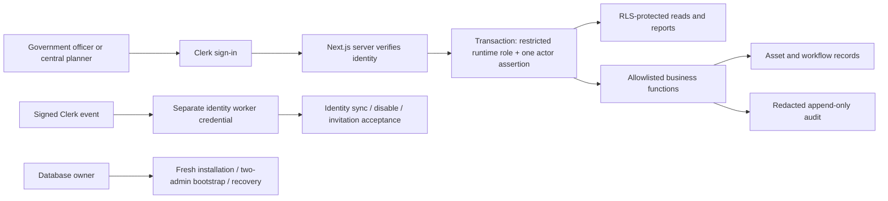
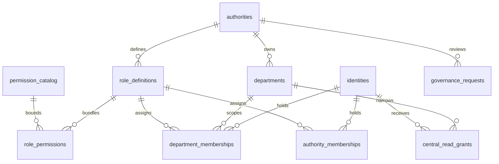
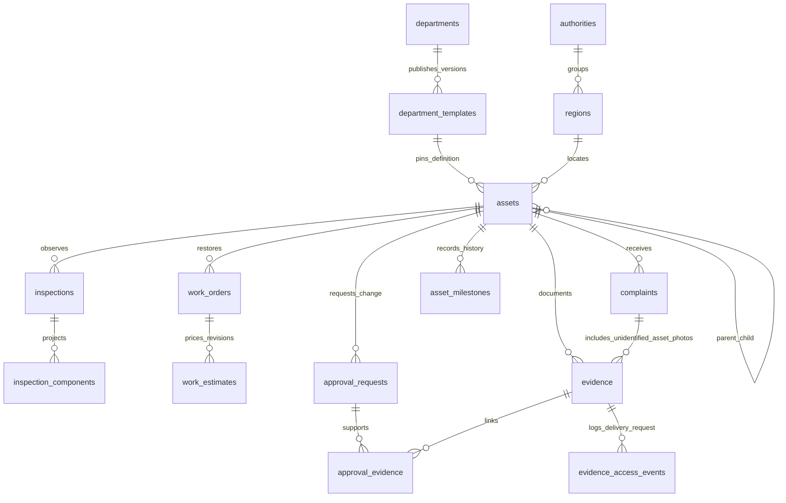

# Asset manager database architecture

This describes the implemented database contract in `schema.sql`. The application-to-database connections below are the required integration design; the separate synthetic frontend does not prove those connections are installed.

## Identity and access boundary



The runtime cannot directly mutate tables, call owner setup or worker identity functions, or change its actor with a custom session setting. The first actor assertion is still trusted server input: the database does not verify a Clerk JWT. All pooled-connection work uses one transaction. The owner remains a privileged trust boundary.

## Government scope and configurable permissions



Department scope is independent of job titles. Non-admin central readers need both an active authority read capability and independently approved department/portfolio grants. Authority administrators have authority-wide administrative visibility. Engineering approval comes from department capabilities. Normal governance changes preserve different effective requester and approver identities; provider security events revoke access immediately and flag recovery.

## Versioned assets and lifecycle evidence



Child references include department identity. An ambiguous complaint may have no asset and still hold evidence. Asset-linked inspection/work/approval evidence must belong to the same asset. Public Cloudinary references are allowed only for labelled synthetic public media; all object keys carry a department prefix. Actual upload ownership and protected delivery are application responsibilities.

Registration quality, lifecycle, availability, approved condition and restoration progress are separate dimensions. Published definitions are immutable. Verified management corrections return registration to submitted; condition updates come only from independently approved observations. Work acceptance and post-work inspection are explicitly linked and cannot invent improved condition.

## Atomic decision path

```mermaid
sequenceDiagram
  participant Officer
  participant Runtime as Restricted runtime function
  participant DB as PostgreSQL transaction
  participant Senior as Independent authorised reviewer
  Officer->>Runtime: Request a sensitive change with expected version
  Runtime->>DB: Validate scope / payload / retry key
  DB-->>Officer: Pending request; effective asset unchanged
  Senior->>Runtime: Approve with reason
  Runtime->>DB: Lock asset then workflow parent; recheck live capability/version
  DB->>DB: Apply permitted transition and decision
  DB->>DB: Append audit in the same transaction
  DB-->>Senior: Commit all, or roll back all
```

Asset-to-parent-to-evidence locking coordinates lifecycle decisions and evidence submission/removal. Multi-session concurrency still needs testing in a real PostgreSQL deployment. Optimistic versions reject stale changes. Retry receipts retain a payload digest and minimal IDs; owner-only pruning retains at least thirty days.

## Reporting and indexes

Current-condition, attention, regional condition/restoration, measurement, component history, region descendants and paired-observation views use the caller's permissions. Unknown/stale observations remain distinct from current assessments. Reviewed estimates use integer paise and the latest revision; missing estimates remain visible. Quantities group by unit/category and separate parents from children.

B-tree indexes support tenant keyset pagination, history, hierarchy, queues and central region filters. `pg_trgm` GIN indexes support bounded literal substring search on names/codes. Indexes do not establish national-scale latency; representative data, query plans and hosted workload checks remain required. The 37 local schema test groups are recorded in `SCHEMA_VALIDATION.md`.
